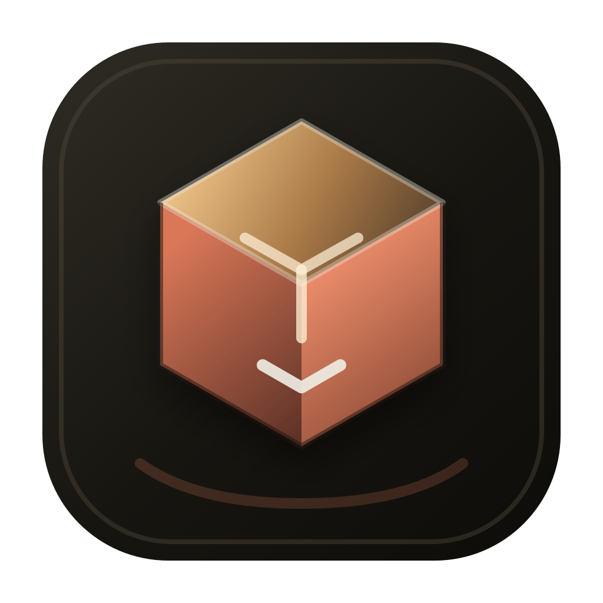
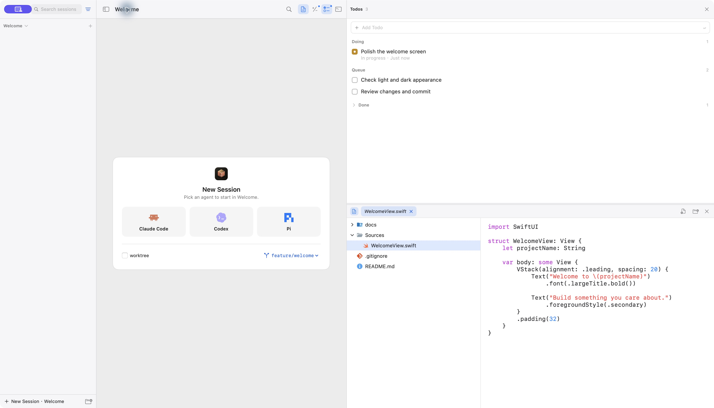
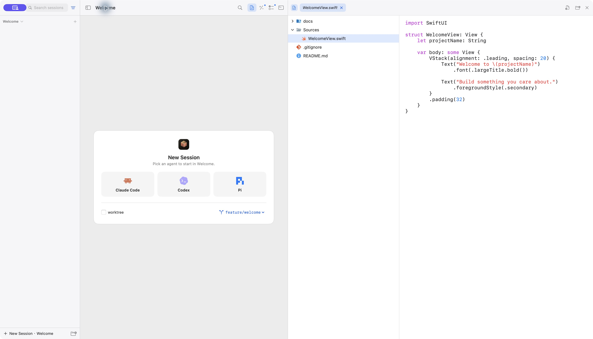
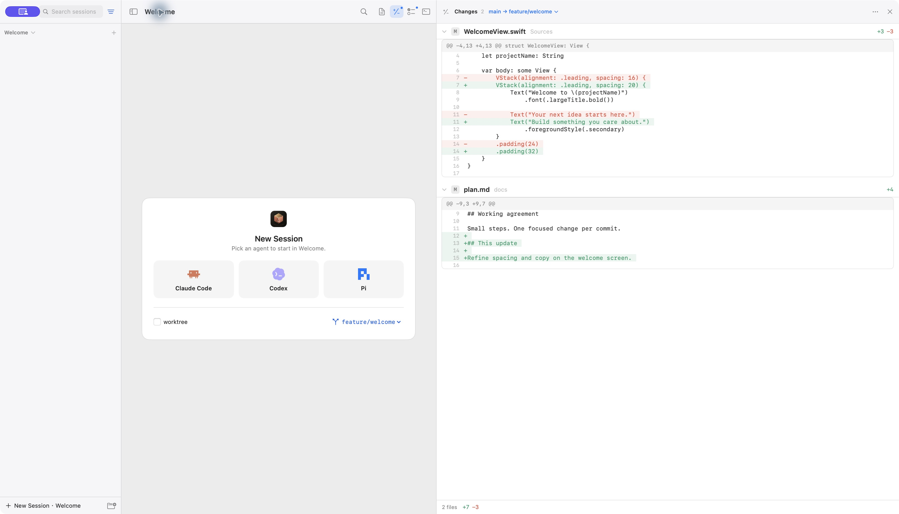

<p align="center">
  
</p>

<h1 align="center">YCode</h1>

<p align="center"><a href="README.md">简体中文</a> · English</p>

<p align="center">Your agents, code, and changes in one workspace.</p>
<p align="center">macOS 14+ · Swift / SwiftUI / AppKit · Apple Silicon / Intel</p>
<p align="center">
  <a href="https://github.com/melon95/YCode/releases/latest">Download YCode</a> ·
  <a href="#getting-started">Getting started</a> ·
  <a href="#building-from-source">Build from source</a> ·
  <a href="LICENSE">MIT License</a>
</p>



YCode is a native macOS workspace for coding agents. Run Claude Code, Codex, Pi, or a custom CLI in separate PTYs, and manage projects and sessions, browse files, review Git changes, and track todos in one window. Interact with each agent through its real terminal interface.

## Features

- **Projects and sessions**: Organize sessions by project, with search, filters, archiving, and resume. Open projects in separate windows when needed.
- **Multiple sessions**: Display up to four sessions at once, switch layouts and focus, and keep each terminal process running independently.
- **Flexible panels**: Open files, changes, todos, and project terminals together. Adjust their arrangement and width.
- **Files and editing**: Browse the file tree, use preview and pinned tabs, edit and save with basic syntax highlighting, preview Markdown, SVG, and images, and handle conflicts from external file changes.
- **Git review**: Read inline diffs, navigate a directory tree, stage individual hunks, commit, switch branches, and fetch, pull, or push. Inspect session checkpoints as well.
- **Todos and integrations**: Organize tasks into queued, in progress, and completed groups. Connect MCP todo tools, agent hooks, and system notifications. History search and usage statistics depend on the corresponding agent's local records.
- **Native appearance**: Light, dark, or system appearance; English and Chinese interfaces; separate font sizes for the interface, editor, and terminal.

### Files and code

Browse directories and source files beside your terminal sessions, and make small edits without leaving the workspace.



### Git changes

Review diffs by file, then stage and commit from the working tree changes view. Expand the directory tree when you need to locate a file.



> Screenshots show native version 0.7.0 in English, using an isolated Welcome demo project and sample todos.

## Getting started

1. Download the native macOS ZIP from [GitHub Releases](https://github.com/melon95/YCode/releases/latest), extract it, and drag `YCode.app` into Applications. Release builds are universal binaries for Apple Silicon and Intel Macs.
2. Install and sign in to the agent CLI you want to use. YCode includes default profiles for Claude Code and Codex. Add Pi or other CLIs in Settings → Agents, with the command, arguments, and environment variables required by each tool.
3. Press `⌘O` to add a local project folder. Choose a Git repository to review changes and create commits.
4. Press `⌘N` and select an agent to start a session. Use the buttons at the top to open files, changes, todos, or a project terminal.
5. Press `⌘K` to search sessions, todos, history, and available actions. Official release builds can receive later versions through Check for Updates in the YCode menu.

YCode does not include agent CLIs, model services, or subscriptions. Runtime requirements, authentication, and charges are handled by each agent's provider.

### Keyboard shortcuts

| Shortcut | Action |
|---|---|
| `⌘O` | Add a project |
| `⌘N` | Create a session |
| `⌘K` | Open the command palette |
| `⌘B` | Show or hide the project sidebar |
| `⌘1` / `⌘2` / `⌘3` / `⌘4` | Toggle files / changes / todos / terminal panels |
| `⌥⌘→` | Show or hide the panel area |
| `⇧⌘1` – `⇧⌘4` | Focus the corresponding session pane |
| `⌘F` | Search the current terminal |
| `⌘S` | Save the file being edited |
| `⇧⌘O` | Open the project in a separate window |

### Current scope

The native macOS version is the actively maintained application. The editor supports file viewing, basic syntax highlighting, and manual editing and saving. It does not provide LSP integration, semantic diagnostics, or go-to-definition. The worktree isolation option in the session picker is not connected yet; use regular project sessions.

The legacy Tauri app and the native app use different update protocols. Install the native app manually for the first upgrade. Development builds use a separate data directory and do not enable the official update feed.

## Building from source

Requires macOS 14 or later, Xcode with a Swift 6 toolchain, and `git`.

```sh
git clone https://github.com/melon95/YCode.git
cd YCode/macos
swift test
scripts/build_and_run.sh run
```

| Command (run from `macos/`) | Purpose |
|---|---|
| `swift test` | Run Swift tests |
| `scripts/build_and_run.sh build` | Build and package the app |
| `scripts/build_and_run.sh run` | Build and launch the app |
| `scripts/build_and_run.sh verify` | Build, launch, and verify the process and signature |

The app is written to `macos/dist/YCode.app`, with build logs at `macos/dist/build.log`. The development version comes from `macos/VERSION`; the build identifier comes from the Git commit.

By default, the build uses the machine's sole Apple Development certificate. It falls back to ad-hoc signing if no certificate is available. If several certificates are installed, select one with `DEV_SIGNING_IDENTITY`. Development signing is distinct from Developer ID distribution signing and notarization. See [macos/README.md](macos/README.md) for more development notes (in Chinese).

Swift Package Manager manages SwiftTerm, swift-markdown, and Sparkle. No Node frontend dependencies are required. External agents still need their own runtime environments.

## Project structure and documentation

| Path | Purpose |
|---|---|
| `macos/YCodeApp/` | SwiftUI / AppKit interface |
| `macos/Core/` | Projects, sessions, PTYs, SQLite, history, Git, and protocol services |
| `macos/EditorSupport/` | Native editing and syntax highlighting |
| `macos/Helpers/` | Swift CLI, MCP, and notification helpers |
| `macos/Resources/` | App resources, icon source data, and licenses |
| `macos/Tests/` | Unit tests and validation tools |
| `macos/scripts/` | Build, packaging, migration, and regression scripts |
| `docs/` | Feature specifications, designs, and migration records |

Additional documentation is currently in Chinese:

- [GitHub builds and update releases](docs/macos-native/github-release.md): CI, signing, notarization, Releases, and Sparkle update configuration.
- [File viewing and manual editing](docs/macos-native/manual-editor-scope.md): The editor's current scope.
- [Native UI implementation notes](docs/macos-native/ui-redesign-implementation.md): Workspace layout and interaction changes.
- [Legacy implementation removal](docs/macos-native/M5.5-legacy-removal.md): Historical Tauri / React / Rust code and backup notes.

Historical migration documents retain the paths and validation records from their time. Refer to this README and the current implementation for the features available today.

## License

[MIT](LICENSE). See [IconSources](macos/Resources/IconSources/README.md) for third-party icon sources and licenses. License files are also bundled with the app.
