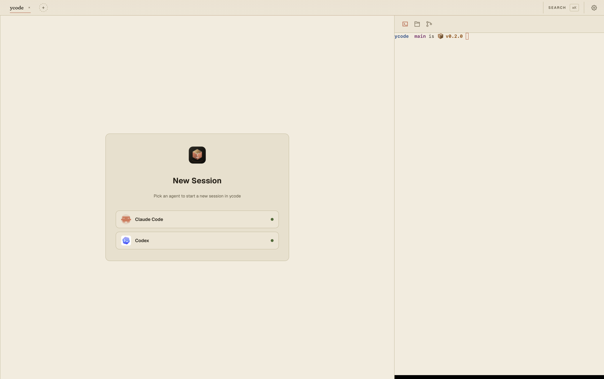
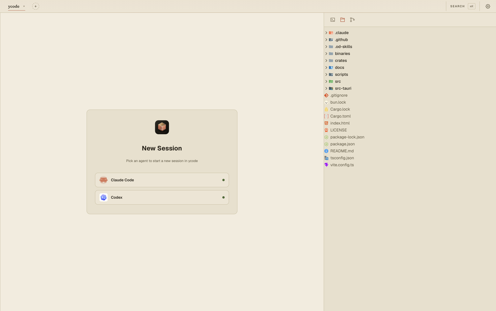
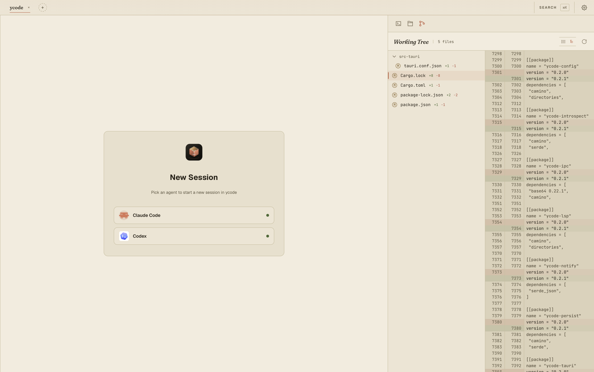

# ycode

[](LICENSE)
[](https://github.com/melon95/YCode/releases)
[](https://tauri.app)

A desktop workbench for running multiple CLI coding agents — Claude Code,
Codex, Gemini CLI, Cursor, anything you can spawn — side by side, each in its
own PTY, with a built-in code editor and shell next to them.

Tauri 2 shell, React 19 frontend, xterm.js terminals, SQLite for session
state. Single static binary.

**[⬇️ Download the latest release](https://github.com/melon95/YCode/releases)**

## Screenshots



|  |  |
| --- | --- |
|  |  |
| Repository file tree + editor entry point | Working tree review with side-by-side diffs |

## Features

- **Multi-agent workspace** — run Claude Code, Codex, Gemini CLI, Cursor, or
  any custom CLI agent side by side in real PTY sessions.
- **Flexible session management** — create, resume, restart, archive, rename,
  and arrange sessions in single, stacked, column, grid, or main+side layouts.
- **Persistent agent history** — scan and search past Claude and Codex
  transcripts, then reopen historical conversations from the sidebar.
- **Built-in project tools** — manage projects, browse files, edit code, use
  the right-side shell terminal, and review Git changes without leaving the
  app.
- **Editor and language support** — CodeMirror editing, syntax highlighting,
  preview tabs, LSP installation, semantic tokens, and goto-definition.
- **Configurable agents** — manage agent commands, args, environment
  variables, icons, and transcript parsers through Settings and the built-in
  agent catalog.
- **Desktop notifications** — optional Claude and Codex hook integrations can
  notify YCode when an agent finishes or needs attention.
- **Personalized desktop app** — themes, font-size controls, persisted window
  state, deep links, and Tauri updater support.

## Layout

Three columns:

- **Sidebar** — projects, sessions, history (jsonl scanner for Claude / Codex
  transcripts), full-text search across past runs.
- **Middle pane** — your CLI agent sessions. Multiple xterm.js terminals
  arranged in `single` / `stack` / `columns` / `2×2` / `main+side` grids.
  Each session is one PTY, restartable, archivable, with title + status
  badges. Close a pane and the agent keeps running in the background.
- **Right pane** — three tabs:
  - **Terminal** — a raw `$SHELL` in the project root. Right-click any pane
    to **Split Right / Left / Up / Down**, drag the divider to resize,
    close panes without killing the others. Layout persists across project
    switches, resets on reload.
  - **Files / Editor** — file tree (react-arborist) + CodeMirror 6 editor
    with syntax highlighting for JS/TS/Python/Rust/HTML/CSS/Markdown/JSON,
    preview-tab semantics borrowed from VS Code. Language servers (LSP) add
    semantic highlighting and goto-definition; install and manage them from
    the **Languages** settings panel.
  - **Changes** — `git status` view with side-by-side diffs.

A command palette (`Cmd-K`) jumps to any project or session.

## Build & run

Requirements: Rust 1.80+, Node 20+, `git` on PATH. For end-to-end agent use,
install whichever CLIs you want to run (`claude`, `codex`, `gemini`, …).

```bash
npm install                       # one-time frontend deps
npm run tauri dev                 # dev with HMR + Tauri webview
npm run dev                       # frontend-only Vite server
npm run build && cargo run -p ycode-tauri   # production-ish standalone
cargo test --workspace            # Rust unit tests
npm run typecheck                 # tsc --noEmit
```

## Agent configuration

User config lives at the platform default
(`~/Library/Application Support/dev.ycode.app/config.json` on macOS).
Missing → the shipped defaults (Claude Code and Codex) are
written on first launch.

```json
{
  "agents": [
    {
      "id": "claude-code",
      "display_name": "Claude Code",
      "command": "claude",
      "args": [],
      "env": {},
      "icon": "ClaudeCode",
      "introspect": "claude"
    },
    {
      "id": "codex",
      "display_name": "Codex",
      "command": "codex",
      "icon": "Codex",
      "introspect": "codex"
    }
  ]
}
```

- `command` is invoked through the user's login shell so `~/.zshrc` (and
  version managers like `fnm` / `nvm` / `asdf`) get a chance to set up PATH
  before the CLI runs.
- `$VAR` references inside `env` are expanded against the host environment
  at load time. Unresolved vars stay as the literal `$VAR` so the spawn
  fails loudly instead of silently launching unauthenticated.
- `introspect` (optional) selects a jsonl parser for the history viewer.
  Currently `claude` and `codex` are recognised; agents without one still
  run, they just don't get the rich transcript view.

The Settings modal in-app edits the same file. New profiles are added from
the built-in agent catalog, then saved as ordinary config entries.

## Workspace layout

```
ycode/
├── Cargo.toml                    # Rust workspace
├── package.json                  # Frontend (React, Vite, Tauri JS API)
├── vite.config.ts                # @bindings/* → crates/ycode-ipc/bindings/
├── src/                          # React + TypeScript
│   ├── App.tsx                   # Three-column layout host
│   ├── lib/
│   │   ├── ipc.ts                # Tauri command wrappers
│   │   ├── store.ts              # Zustand store
│   │   ├── hotkeys.tsx           # Cmd-K, layout cycle, pane focus
│   │   └── types.ts
│   └── components/
│       ├── TopBar.tsx            # Project picker + agent launcher
│       ├── Sidebar.tsx           # Sessions / history tabs
│       ├── TerminalPane.tsx      # Middle: agent xterm grid
│       ├── ManualTerminal.tsx    # Right: a single $SHELL xterm
│       ├── RightTerminalSplit.tsx# Right: binary-split host
│       ├── RightPane.tsx         # Right-tab container
│       ├── EditorPanel.tsx       # CodeMirror editor
│       ├── FileTreePanel.tsx     # react-arborist tree
│       ├── ChangesPanel.tsx      # git status + diffs
│       ├── HistoryTab.tsx        # jsonl transcript viewer
│       ├── CommandPalette.tsx    # Cmd-K palette
│       └── SettingsModal.tsx     # Agent profile editor
├── src-tauri/                    # Tauri shell
│   └── src/
│       ├── lib.rs                # tauri::Builder setup
│       ├── state.rs              # Wires Service into AppState
│       └── commands.rs           # #[tauri::command] glue
└── crates/
    ├── ycode-terminal/           # portable-pty wrapper, TerminalSession
    ├── ycode-persist/            # sqlx + SQLite (projects, sessions, WAL)
    ├── ycode-config/             # config.json schema + $VAR expansion
    ├── ycode-introspect/         # claude/codex jsonl scanners + parsers
    ├── ycode-lsp/                # language-server install + LSP client
    ├── ycode-notify/             # desktop notifications
    └── ycode-ipc/                # Service facade, DTOs, ts-rs bindings
```

The frontend imports DTOs from `@bindings/*` — ts-rs writes them into
`crates/ycode-ipc/bindings/` whenever the Rust struct changes (run
`cargo test` on the ipc crate to regenerate).

## Thanks

Thanks to [Linux Do](https://linux.do) for the promotion and support.

## License

MIT — see [LICENSE](LICENSE).
